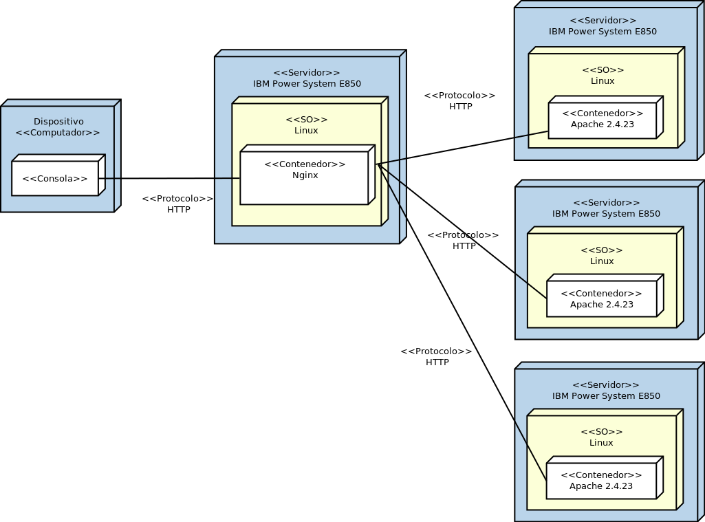

### Examen 2
**Universidad ICESI**  
**Curso:** Sistemas Distribuidos  
**Docente:** Daniel Barragán C.  
**Tema:** Automatización de infraestructura (Docker)  
**Correo:** daniel.barragan at correo.icesi.edu.co

### Objetivos
* Realizar de forma autónoma el aprovisionamiento automático de infraestructura
* Diagnosticar y ejecutar de forma autónoma las acciones necesarias para lograr infraestructuras estables
* Integrar servicios ejecutandose en nodos distintos

### Prerrequisitos
* Docker
* Imágenes de sistemas operativos a elección del estudiante
* Mirror con aptly

### Nota Importante
El parcial debe realizarse de forma individual, en caso de encontrar copia a otros compañeros se anulará su examen. Podrá usar cualquier material de clase o realizar consultas en Internet. Una vez termine correctamente la parte práctica se le pedirá que realice la respectiva sustentación de su solución, esta sustentación tendrá un factor de 0 a 1 sobre el valor del punto.

### Descripción
Deberá	realizar	el	aprovisionamiento	de	un	ambiente	compuesto	por	los	siguientes	elementos:	un servidor	encargado de	realizar balanceo de	carga,	tres	servidores	web	con páginas estáticas. Se	debe probar	el	funcionamiento	del balanceador	realizando peticiones y mostrando servidores distintos atendiendo las peticiones.

  

En el repositorio de github del curso se encuentran ejemplos de docker y docker-compose los cuales pueden ser consultados para construir su solución.

### Actividades
En un documento en formato PDF cuyo nombre de
archivo debe ser examen2_codigoestudiante.pdf debe incluir lo siguiente:

1. Documento en formato PDF:  
  * Formato PDF (5%)
  * Nombre y código de los integrantes del grupo (5%)
  * Ortografía y redacción (5%)
2. Consigne los comandos de linux necesarios para el aprovisionamiento de los servicios solicitados. En este punto no debe incluir archivos tipo Dockerfile solo se requiere que usted identifique los comandos o acciones que debe automatizar (15%)
3. Escriba los archivos Dockerfile para cada uno de los servicios solicitados junto con los archivos fuente necesarios. Tenga en cuenta consultar buenas prácticas para la elaboración de archivos Dockerfile. (20%)
4. Escriba el archivo docker-compose.yml necesario para el despliegue de la infraestructura (10%)
5. Publicar en un repositorio de github los archivos para el aprovisionamiento junto con un archivo de extensión .md donde explique brevemente como realizar el aprovisionamiento (15%)
6. Incluya evidencias que muestran el funcionamiento de lo solicitado (15%)
7. Documente algunos de los problemas encontrados y las acciones efectuadas para su solución al aprovisionar la infraestructura y aplicaciones (10%)

### Referencias
* https://github.com/rhcarvalho/byzanz-gui
* https://docs.docker.com/
